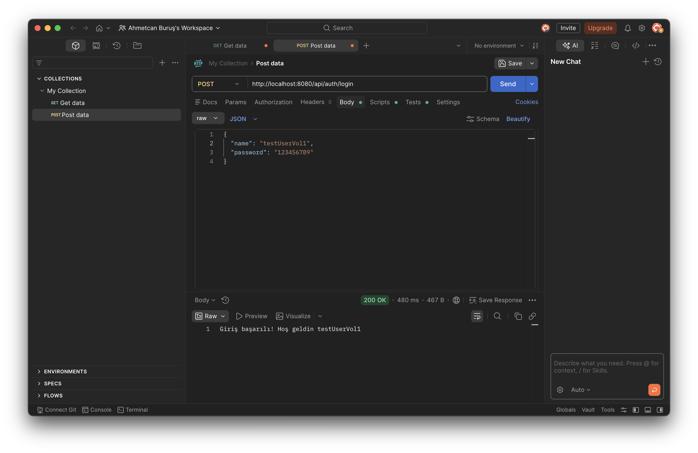

# Spring Boot Auth API

A simple authentication REST API built with Spring Boot and Spring Security.

This project includes user registration and login functionality with BCrypt password encryption and PostgreSQL database integration.

⚠️ This project does NOT include JWT authentication.

---

## 📌 Endpoints

```http
POST /api/auth/register
POST /api/auth/login
```

---

## 🚀 Features

- User Registration
- User Login Authentication
- Spring Security Integration
- BCrypt Password Encryption
- PostgreSQL Database Support
- RESTful API Structure
- Maven Project Structure

---

## 🛠️ Technologies

- Java
- Spring Boot
- Spring Security
- Maven
- PostgreSQL

---

## ⚙️ Setup

### 1. Clone the repository

```bash
git clone https://github.com/ahmetburus95/SpringBoot-auth-api.git
```

---

### 2. Configure Database

Create:

```text
src/main/resources/application.yml
```

Example configuration:

```yml
spring:
  datasource:
    url: YOUR_DB_URL
    username: YOUR_USERNAME
    password: YOUR_PASSWORD

  jpa:
    hibernate:
      ddl-auto: update
```

---

### 3. Run the project

```bash
./mvnw spring-boot:run
```

## 📷 API Screenshots

### Login Request


### Register Request


---

## 👨‍💻 Author

Ahmetcan Buruş
